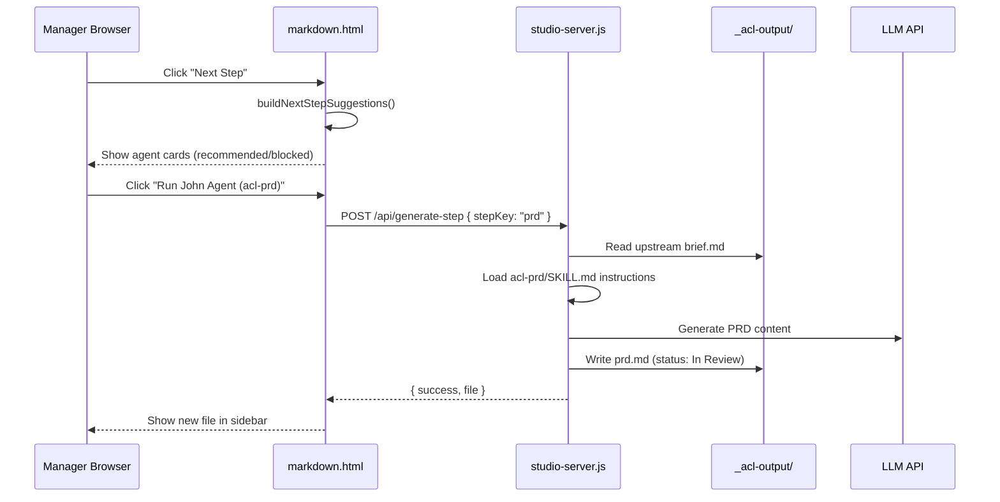
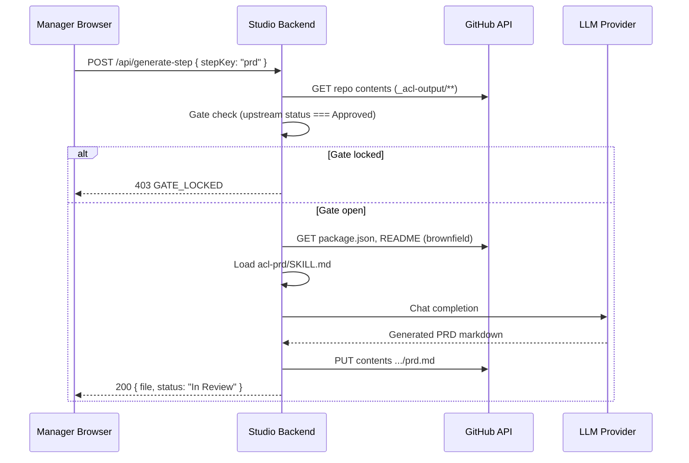

# Hosted Agent Generation from Markdown Studio

> **Purpose:** Specification and migration guide for Markdown Studio agent generation — from your older `ACL-ADLC-V1` repo through the current `ACL-ACLC/ACL-ADLC-V1` implementation, including the **Next Step suggestion modal**, local testing, and the remaining work for full hosted (GitHub) deployment.

**Last updated:** 2026-03-01  
**Current framework version:** `acl-adlc@6.11.7` (repo: `ACL-ACLC/ACL-ADLC-V1`)  
**This repo:** `Documents/react/ACL-ADLC-V1` published as `acl-adlc-v1@6.11.0`

---

## Table of contents

1. [What this project is](#1-what-this-project-is)
2. [Implementation status (what exists today)](#2-implementation-status-what-exists-today)
3. [Next Step suggestion modal (implemented)](#3-next-step-suggestion-modal-implemented)
4. [Old repo vs current repo comparison](#4-old-repo-vs-current-repo-comparison)
5. [How install & deploy works](#5-how-install--deploy-works)
6. [Local testing guide (fleet-360-new)](#6-local-testing-guide-fleet-360-new)
7. [Migration: update your older ACL-ADLC repo](#7-migration-update-your-older-acl-adlc-repo)
8. [Hosted agent generation (still to build)](#8-hosted-agent-generation-still-to-build)
9. [Agent → skill mapping reference](#9-agent--skill-mapping-reference)
10. [Constraints to preserve](#10-constraints-to-preserve)
11. [Summary checklist](#11-summary-checklist)

---

## 1. What this project is

**ACL-ADLC** is a customized fork of the [BMAD Method](https://github.com/bmad-code-org/BMAD-METHOD), rebranded for personal and team use. It is distributed as an npm package (`acl-adlc-v1`) and installs into any target project via:

```bash
npx acl-adlc-v1 install
```

### What gets installed into a target project

| Artifact | Purpose |
|----------|---------|
| `_acl/` | Framework config, scripts, installed skills |
| `_acl-output/` | Sequential deliverable markdown files (brief → PRD → architecture → epics → implementation) |
| `public/markdown.html` | **Markdown Studio** — browser UI for listing, editing, approving, and generating deliverables |
| `public/greenfield.svg`, `public/brownfield.svg` | Workflow diagrams shown in Studio |
| `.cursor/skills/` or `.agents/skills/` (IDE-dependent) | Agent personas and workflow skills for the IDE |

### Core delivery model

ACL-ADLC enforces a **sequential phase-gate protocol**:

1. An agent/skill (in the IDE or via Studio) **creates** a markdown deliverable with `status: In Review`.
2. A **manager** reviews it in Markdown Studio and sets `status: Approved` or `Rejected`.
3. Downstream agents/skills are **blocked** until upstream documents are `Approved`.
4. Gate enforcement is in every `SKILL.md`, `AGENTS.md`, `.cursorrules`, and `tools/adlc-gate-guard.cjs`.

Only the manager may change review status — AI agents are forbidden from self-approving.

### Sequential one-agent-at-a-time rule

Generation is **one deliverable per agent invocation**:

```
Mary (brief) → manager approves → John (prd) → manager approves →
Winston (architecture) OR Sally (ux) → manager approves →
Epics → Amelia (story implementation) → ...
```

The manager never auto-runs the whole pipeline. Each step requires explicit selection (via the Next Step modal) and manager approval before the next agent unlocks.

---

## 2. Implementation status (what exists today)

| Feature | Old repo (`ACL-ADLC-V1`) | Current repo (`ACL-ACLC/ACL-ADLC-V1`) |
|---------|--------------------------|--------------------------------------|
| Manager review UI | `acl-docs-console.html` | `public/markdown.html` (Markdown Studio) |
| Approve / Reject / Edit MD | ✅ GitHub API (`api/update-doc.js`) | ✅ Local disk + optional git push |
| List `_acl-output` files | ✅ via `manifest.json` + Vite plugin | ✅ `/api/list-markdown-files` |
| Agent generation from browser | ❌ Not built | ✅ `/api/generate-step` via `studio-server.js` |
| Next Step suggestion modal | ❌ Not built | ✅ **Implemented** — see Section 3 |
| Hosted GitHub read/write for generation | ✅ Approve/Reject only | ⚠️ Save works locally; hosted generation still TODO |
| Status vocabulary | `draft`, `pending-review`, `approved`, `rejected` | `In Review`, `Approved`, `Rejected` |
| `studio-server.js` | ❌ Does not exist | ✅ `tools/studio-server.js` on port 3333 |
| Installer deploys Studio HTML | `acl-docs-console.html` at project root | `public/markdown.html` |

---

## 3. Next Step suggestion modal (implemented)

### Behaviour

When the manager clicks **Next Step ➔** in Markdown Studio:

1. A modal opens: **Choose Agent & Deliverable**
2. The UI scans `_acl-output/` and evaluates the pipeline state
3. Each ACL step is shown as a card with:
   - Agent name (Mary, John, Winston, Sally, Amelia)
   - Skill ID (`acl-prd`, `acl-architecture`, etc.)
   - Phase label (Phase 1, 3A, 4, …)
   - Badge: **Recommended** / **Available** / **Blocked** / **Completed**
   - Blocked reason when prerequisites are not met
4. Manager clicks **Run {Agent} Agent ({skillId}) ➔** on one card
5. Only that single agent runs via `POST /api/generate-step`
6. Output file is written with `status: In Review`
7. Manager reviews and approves before the next step unlocks

### Gate rules enforced in the modal

| stepKey | Skill | Requires upstream Approved |
|---------|-------|---------------------------|
| `project_context` | `acl-generate-project-context` | None (brownfield start) |
| `brief` | `acl-product-brief` | `project_context` (brownfield only, if context file exists) |
| `prd` | `acl-prd` | `brief.md` |
| `architecture` | `acl-architecture` | `prd.md` |
| `ux` | `acl-ux` | `prd.md` |
| `epics_stories` | `acl-create-epics-and-stories` | `prd.md` + (`architecture.md` OR `ux.md`) |
| `implementation_scaffold` | `acl-dev-auto` | `epics.md` (greenfield) |
| `quick_dev` | `acl-quick-dev` | `epics.md` (brownfield) |
| `story_impl` | `acl-dev-auto` | `epics.md` |

### Proceed button states

| State | Button |
|-------|--------|
| No files yet | **Next Step ➔** enabled — modal suggests first agent |
| Active file `In Review` | **Gate Locked** — disabled |
| Active file `Approved` | **Next Step ➔** enabled — opens suggestion modal |
| All steps complete | **Pipeline Complete** — disabled |

### Source code (current repo only)

| File | What to port |
|------|--------------|
| `src/public/markdown.html` | Full Studio UI including `AGENT_STEP_CATALOG`, `buildNextStepSuggestions()`, `renderNextStepModal()`, `openNextStepModal()`, `handleProceedNextStep()` |
| `tools/studio-server.js` | `generateWithAgent()`, `readUpstreamArtifacts()`, `/api/generate-step` |
| `tools/installer/core/installer.js` | Copies `markdown.html` → target `public/` on install |

### Architecture (local)



---

## 4. Old repo vs current repo comparison

### Your older repo: `Documents/react/ACL-ADLC-V1` (v6.11.0)

```
ACL-ADLC-V1/
├── src/docs-console/
│   ├── acl-docs-console.html      ← Manager UI (approve/reject only)
│   ├── api/update-doc.js          ← GitHub Contents API for hosted saves
│   ├── vite-plugin-acl-docs.ts    ← Local manifest + static serve
│   └── README.md
├── tools/installer/core/installer.js  ← Installs docs-console, NOT markdown.html
└── (no studio-server.js, no markdown.html, no generate-step)
```

**Install output in target project:**

| File | Location |
|------|----------|
| `acl-docs-console.html` | Project root |
| `vite-plugin-acl-docs.ts` | Project root |
| `api/update-doc.js` | Project `api/` (for Vercel) |
| `_acl/docs-console/README.md` | Installed guide |

**Status frontmatter (old):**

```yaml
status: draft | pending-review | approved | rejected
```

### Current repo: `ACL-ACLC/ACL-ADLC-V1` (v6.11.7)

```
ACL-ACLC/ACL-ADLC-V1/
├── src/public/
│   ├── markdown.html              ← Markdown Studio (review + Next Step modal + generation)
│   ├── greenfield.svg
│   └── brownfield.svg
├── tools/
│   ├── studio-server.js           ← Local API server (list, save, generate-step)
│   └── installer/core/installer.js  ← Deploys markdown.html to public/
└── (docs-console still exists in old repo path only — replaced by markdown.html)
```

**Install output in target project:**

| File | Location |
|------|----------|
| `markdown.html` | `public/markdown.html` |
| `greenfield.svg`, `brownfield.svg` | `public/` |
| Vite middleware | Injected into `vite.config.*` for `/api/list-markdown-files` and `/api/save-markdown` |

**Status frontmatter (current):**

```yaml
status: In Review | Approved | Rejected
reviewed_by: Manager (via Markdown Studio)
review_timestamp: ...
gate_signature: ACL-STUDIO-APPROVAL-APPROVED
```

### Key decision when updating your old repo

You can either:

- **Option A (recommended):** Adopt `markdown.html` + `studio-server.js` from the current repo and retire `acl-docs-console.html` for new projects.
- **Option B:** Keep `acl-docs-console.html` for hosted GitHub approve/reject and add `markdown.html` + `studio-server.js` for local agent generation (two UIs — more maintenance).

---

## 5. How install & deploy works

The framework repo holds the **source template**. Target projects get a **copy on install**.

```
ACL-ACLC/ACL-ADLC-V1 (framework)          fleet-360-new (target project)
────────────────────────────────          ─────────────────────────────
src/public/markdown.html  ──install──►    public/markdown.html
tools/studio-server.js    (stays in       Run manually or from node_modules
                           framework)      with ACL_PROJECT_ROOT=<project>
src/acl-skills/**         ──install──►    _acl/ + IDE skills
                                          _acl-output/ (deliverables)
```

```bash
# Install into a target project
cd c:\Users\karthik.r\Documents\react\fleet-360-new
node c:\Users\karthik.r\Documents\react\ACL-ACLC\ACL-ADLC-V1\tools\installer\acl-cli.js install --directory .
```

Or copy only the Studio file during development:

```powershell
Copy-Item `
  "c:\Users\karthik.r\Documents\react\ACL-ACLC\ACL-ADLC-V1\src\public\markdown.html" `
  "c:\Users\karthik.r\Documents\react\fleet-360-new\public\markdown.html" -Force
```

---

## 6. Local testing guide (fleet-360-new)

Validated test project: `c:\Users\karthik.r\Documents\react\fleet-360-new`

### Prerequisites

- ACL-ADLC installed (`_acl/` folder present)
- `_acl-output/` with sample deliverables
- Updated `public/markdown.html` from current framework repo

### Sample test files created

| File | Status | Path |
|------|--------|------|
| `brief.md` | Approved | `_acl-output/1-analysis/acl-product-brief/brief.md` |
| `prd.md` | In Review | `_acl-output/2-plan-workflows/acl-prd/prd.md` |

### Start servers

**Option A — Full features (recommended for agent generation):**

```powershell
$env:ACL_PROJECT_ROOT = "c:\Users\karthik.r\Documents\react\fleet-360-new"
node "c:\Users\karthik.r\Documents\react\ACL-ACLC\ACL-ADLC-V1\tools\studio-server.js"
```

Open: **http://localhost:3333/markdown.html**

Supports: list, edit, save, **Next Step modal**, **`/api/generate-step`**

**Option B — Vite dev server (basic review only):**

```powershell
Set-Location "c:\Users\karthik.r\Documents\react\fleet-360-new"
npm run dev
```

Open: **http://localhost:5173/markdown.html**

Supports: list, edit, save via Vite middleware.  
Does **not** support `/api/generate-step` (agent generation falls back to empty template).

### Test checklist

| # | Action | Expected result |
|---|--------|-----------------|
| 1 | Open Studio URL | Sidebar shows `brief.md` and `prd.md` |
| 2 | Select `brief.md` | Status = Approved, preview renders |
| 3 | Click **Next Step ➔** | Modal opens; PRD card is **Recommended** |
| 4 | Select `prd.md` | Status = In Review |
| 5 | Click **Next Step** on `prd.md` | Button disabled — Gate Locked |
| 6 | Approve `prd.md`, click **Next Step** | Architecture + UX both **Recommended** |
| 7 | Run one agent from modal | New `.md` file appears with `status: In Review` |

### Verify API directly

```powershell
Invoke-RestMethod -Uri "http://localhost:3333/api/list-markdown-files"
```

---

## 7. Migration: update your older ACL-ADLC repo

Use this checklist to bring `Documents/react/ACL-ADLC-V1` in line with the current implementation.

### Phase 1 — Copy new Studio files into your old framework repo

Copy from `ACL-ACLC/ACL-ADLC-V1` → `ACL-ADLC-V1`:

| Source (current) | Destination (your old repo) | Required? |
|------------------|----------------------------|-----------|
| `src/public/markdown.html` | `src/public/markdown.html` *(create `src/public/` if missing)* | **Yes** |
| `src/public/greenfield.svg` | `src/public/greenfield.svg` | **Yes** |
| `src/public/brownfield.svg` | `src/public/brownfield.svg` | **Yes** |
| `tools/studio-server.js` | `tools/studio-server.js` *(new file)* | **Yes** |
| `tools/adlc-gate-guard.cjs` | `tools/adlc-gate-guard.cjs` *(if missing)* | Recommended |
| `docs/explanation/hosted-agent-generation-feature.md` | `docs/explanation/hosted-agent-generation-feature.md` | This guide |

**PowerShell one-liner (run from any directory):**

```powershell
$src = "c:\Users\karthik.r\Documents\react\ACL-ACLC\ACL-ADLC-V1"
$dst = "c:\Users\karthik.r\Documents\react\ACL-ADLC-V1"

New-Item -ItemType Directory -Force -Path "$dst\src\public" | Out-Null
Copy-Item "$src\src\public\markdown.html" "$dst\src\public\" -Force
Copy-Item "$src\src\public\greenfield.svg" "$dst\src\public\" -Force
Copy-Item "$src\src\public\brownfield.svg" "$dst\src\public\" -Force
Copy-Item "$src\tools\studio-server.js" "$dst\tools\" -Force
Copy-Item "$src\tools\adlc-gate-guard.cjs" "$dst\tools\" -Force -ErrorAction SilentlyContinue
New-Item -ItemType Directory -Force -Path "$dst\docs\explanation" | Out-Null
Copy-Item "$src\docs\explanation\hosted-agent-generation-feature.md" "$dst\docs\explanation\" -Force
```

> **Important:** This markdown file is the **guide**. The actual implementation lives in the files above (~4,200 lines of HTML/JS). You cannot implement Studio from this doc alone — you must copy those source files.

### Phase 2 — Update installer (`tools/installer/core/installer.js`)

Replace or merge the **docs-console install block** (~line 712 in old repo) with the **markdown.html deploy block** from current repo (~line 698):

- Copy `src/public/markdown.html` → target `public/markdown.html`
- Embed existing `_acl-output` files as `window.__ACL_EMBEDDED_FILES__`
- Deploy `greenfield.svg` and `brownfield.svg`
- Inject Vite `aclMarkdownSaverPlugin` middleware (list + save APIs)

**Do not hand-merge line-by-line.** Safest approach:

1. Open both repos side by side:
   - Old: `ACL-ADLC-V1/tools/installer/core/installer.js`
   - Current: `ACL-ACLC/ACL-ADLC-V1/tools/installer/core/installer.js`
2. Copy these methods/blocks from **current** → **old**:
   - `_deployMarkdownStudio()` or the block starting at `// Deploy markdown.html studio` (~line 698)
   - `_configureViteProject()` (~line 768)
   - `_scanProjectMarkdownFiles()` (~line 901)
3. In old repo's main install flow, **call** the markdown deploy method instead of (or after) `_installDocsConsole()`.
4. Keep `_installDocsConsole()` behind `--with-docs-console` if you still want backward compatibility.

Remove or keep docs-console behind a flag:

```bash
# Old flags (your repo)
--with-docs-console / --no-docs-console

# Consider deprecating docs-console in favour of markdown.html
```

### Phase 2b — Update `package.json` scripts (framework repo)

Add to your old repo's `package.json` if missing:

```json
{
  "scripts": {
    "gate:wait": "node tools/adlc-gate-guard.cjs --wait",
    "gate:watch": "node tools/adlc-gate-guard.cjs --watch",
    "validate:gates": "node tools/adlc-gate-guard.cjs --validate-all"
  }
}
```

Ensure `tools/` is in the npm `"files"` array so `studio-server.js` ships with the package.

### Phase 3 — Align status vocabulary

If existing projects use old status values, migrate frontmatter:

| Old (`ACL-ADLC-V1`) | New (Markdown Studio) |
|---------------------|----------------------|
| `draft` | `In Review` |
| `pending-review` | `In Review` |
| `approved` | `Approved` |
| `rejected` | `Rejected` |

Update `src/scripts/check_docs_approval.py` and `docs_review_gates.toml` if they check for `approved` lowercase — ensure they also accept `Approved` / `In Review`.

### Phase 4 — Port hosted GitHub save from old docs-console

Your old repo already has hosted GitHub writes in `src/docs-console/api/update-doc.js`. For the new Studio, either:

1. **Merge** that logic into a new `tools/github-storage.js` used by `studio-server.js`, or
2. **Keep** `api/update-doc.js` for hosted approve/reject and add a separate `api/generate-step` serverless function later.

### Phase 5 — Re-install into target projects

```powershell
cd c:\Users\karthik.r\Documents\react\fleet-360-new
node c:\Users\karthik.r\Documents\react\ACL-ADLC-V1\tools\installer\acl-cli.js install --directory .
```

Or publish to npm and run `npx acl-adlc-v1 install` from the updated package.

### Phase 6 — Deprecation notes

| Old artifact | Replacement |
|--------------|-------------|
| `acl-docs-console.html` | `public/markdown.html` |
| `vite-plugin-acl-docs.ts` | Vite middleware in `installer.js` + `studio-server.js` |
| `api/update-doc.js` | `POST /api/save-markdown` (local) + future GitHub provider |
| `status: pending-review` | `status: In Review` |

### Phase 7 — Known fixes after copying (do not skip)

| Issue | Where | Fix |
|-------|-------|-----|
| Hardcoded LLM API key in browser | `markdown.html` ~line 2300 | Move key to `studio-server.js` env var `LLM_API_KEY`; remove from HTML request body |
| Hardcoded `projectTitle: 'Fleet 360 Delivery'` | `markdown.html` `executeStepGeneration()` | Read from config or `_acl-output` brief title |
| `studio-server.js` wrong skill path for project context | `readSkillInstructions()` skillMap | Both repos store skill at `3-solutioning/acl-generate-project-context/` — update map from `0-context/...` to `3-solutioning/...` |
| `studio-server.js` hardcoded `SAMPLE_DIR` | Line 7 | Rely on `ACL_PROJECT_ROOT` env var only; remove hardcoded path |
| Vite middleware missing `generate-step` | Target `vite.config.ts` | Agent generation only works via `studio-server.js` on port 3333, not Vite dev server |
| Old `check_docs_approval.py` expects `approved` lowercase | `src/scripts/check_docs_approval.py` | Accept both `approved` and `Approved` / `In Review` |
| Status mismatch in Vite plugin | Injected `aclMarkdownSaverPlugin` | Maps `In Review` incorrectly if `includes('updated')` — test status parsing after install |

---

## 8. Hosted agent generation (still to build)

The **Next Step modal** and **local `generate-step`** are implemented. Full **hosted** generation (manager on `https://your-domain/markdown.html` reading/writing GitHub without a local clone) is still pending.

### What works today (local)

| Capability | Status |
|------------|--------|
| Next Step suggestion modal | ✅ Done |
| One agent per generation call | ✅ Done |
| Gate rules in modal UI | ✅ Done |
| `generate-step` with SKILL.md + upstream context | ✅ Done (`studio-server.js`) |
| LLM generation (NVIDIA API) | ✅ Done (move API key to server env — not browser) |
| Local disk read/write | ✅ Done |
| Git auto-push on save | ⚠️ Implemented but `autoPush: false` in UI |

### What is still needed for hosted

| Capability | Status |
|------------|--------|
| GitHub-backed file list (not local disk) | ❌ TODO — `tools/github-storage.js` |
| GitHub-backed write on generate/save | ❌ TODO — port from old `api/update-doc.js` |
| `GET /api/gate-check` server-side | ❌ TODO |
| Secure LLM key on server only | ❌ TODO — remove hardcoded key from `markdown.html` |
| Manager auth (GitHub OAuth) | ❌ TODO |
| `window.__ACL_API_BASE__` for cross-origin hosted API | ❌ TODO |
| Deploy `studio-server.js` or serverless equivalent | ❌ TODO |

### Recommended hosted architecture



### Fastest hosted MVP (without GitHub API layer)

1. Deploy a VPS with the target repo cloned.
2. Run `studio-server.js` with `ACL_PROJECT_ROOT` pointing at the clone.
3. Set `autoPush: true` on save/generate so writes push to GitHub.
4. Access `http://your-server:3333/markdown.html`.

**Trade-off:** server must `git pull` to stay in sync with other contributors.

### Environment variables (future hosted backend)

```env
ACL_PROJECT_ROOT=/app
ACL_STORAGE_MODE=github          # local | github
GITHUB_OWNER=your-org
GITHUB_REPO=your-project
GITHUB_TOKEN=ghp_...
GITHUB_BRANCH=main
LLM_API_KEY=...
LLM_MODEL=meta/llama-3.3-70b-instruct
DOCS_EDIT_SECRET=optional-shared-password
```

### Re-use from your old repo

Your `ACL-ADLC-V1` already implements GitHub Contents API writes in:

```
src/docs-console/api/update-doc.js
```

Port the `getFileSha`, `putFile`, and auth patterns from that file into `tools/github-storage.js` for the new Studio backend.

---

## 9. Agent → skill mapping reference

| Modal card | Agent | skill id | stepKey | Output path |
|------------|-------|----------|---------|-------------|
| 🔍 Project Context | Mary | `acl-generate-project-context` | `project_context` | `_acl-output/0-context/acl-generate-project-context/project-context.md` |
| 📊 Product Brief | Mary | `acl-product-brief` | `brief` | `_acl-output/1-analysis/acl-product-brief/brief.md` |
| 📋 PRD | John | `acl-prd` | `prd` | `_acl-output/2-plan-workflows/acl-prd/prd.md` |
| 🏛️ Architecture | Winston | `acl-architecture` | `architecture` | `_acl-output/3-solutioning/acl-architecture/architecture.md` |
| 🎨 UX | Sally | `acl-ux` | `ux` | `_acl-output/3-solutioning/acl-ux/ux.md` |
| 📑 Epics & Stories | John | `acl-create-epics-and-stories` | `epics_stories` | `_acl-output/3-solutioning/acl-create-epics-and-stories/epics.md` |
| 💻 Implementation Scaffold | Amelia | `acl-dev-auto` | `implementation_scaffold` | `_acl-output/4-implementation/acl-dev-auto/step-01-scaffold.md` |
| ⚡ Quick Dev | Amelia | `acl-quick-dev` | `quick_dev` | `_acl-output/4-implementation/acl-quick-dev/quick-dev.md` |
| 🚀 Story Implementation | Amelia | `acl-dev-auto` | `story_impl` | `_acl-output/4-implementation/acl-dev-auto/story-{id}.md` |

Named persona agents (`acl-agent-pm`, `acl-agent-architect`, etc.) are **menus that route to these skills** — the modal triggers the **skill** (`acl-prd`), not the persona wrapper.

---

## 10. Constraints to preserve

1. **Generated files must start as `status: In Review`** — never `Approved`.
2. **One agent per generation call** — manager picks from the modal; no auto-chaining.
3. **Gate check must run server-side** for hosted — UI blocking alone is not enough.
4. **Manager-only approval** — generate creates files; only the manager changes status to Approved.
5. **IDE agents remain compatible** — same `_acl-output/` paths and frontmatter so `adlc-gate-guard.cjs` and IDE skills work after `git pull`.
6. **Framework source vs target project** — develop in `ACL-ACLC/ACL-ADLC-V1`; deploy to target projects via install or copy.

---

## 11. Summary checklist

### What this document IS

| ✅ Included | Description |
|-------------|-------------|
| Feature specification | What Markdown Studio + Next Step modal does |
| Old vs new repo comparison | What changed between `ACL-ADLC-V1` and current |
| Migration phases | Ordered steps to update your framework repo |
| Copy manifest + PowerShell script | Exact files to copy |
| Local testing guide | `fleet-360-new` + studio-server commands |
| Hosted roadmap | What still needs building for GitHub-hosted generation |
| Gate rules & agent mapping | Reference tables |

### What this document IS NOT

| ❌ Not included | What to do instead |
|----------------|-------------------|
| Full source code of `markdown.html` (~2,800 lines) | Copy `src/public/markdown.html` from current repo |
| Full source code of `studio-server.js` (~1,400 lines) | Copy `tools/studio-server.js` from current repo |
| Complete merged `installer.js` | Diff and merge manually (see Phase 2) |
| Automated migration script | Run the PowerShell copy commands in Phase 1 |
| Hosted GitHub backend | Still TODO — see Section 8 |

### For you (updating `ACL-ADLC-V1`)

- [ ] Copy `src/public/markdown.html` + SVGs from current repo
- [ ] Add `tools/studio-server.js`
- [ ] Update `installer.js` to deploy `markdown.html` instead of (or in addition to) `acl-docs-console.html`
- [ ] Add `gate:wait` / `validate:gates` scripts to `package.json`
- [ ] Apply Phase 7 known fixes (LLM key, skill paths, status vocabulary)
- [ ] Align status vocabulary (`In Review` / `Approved` / `Rejected`)
- [ ] Port `api/update-doc.js` GitHub logic into future `github-storage.js`
- [ ] Test with `fleet-360-new` using studio-server on port 3333
- [ ] Publish updated `acl-adlc-v1` package

### Feature status

| Question | Answer |
|----------|--------|
| Next Step modal with agent suggestions? | ✅ **Done** in current `markdown.html` |
| One agent at a time generation? | ✅ **Done** |
| Local test with `_acl-output`? | ✅ **Done** — see Section 6 |
| Hosted GitHub read for generation? | ❌ **TODO** |
| Hosted GitHub write for generation? | ❌ **TODO** (old repo has approve/reject write only) |
| Per-agent toolbar buttons (always visible)? | ❌ Not built — modal on **Next Step** instead (by design) |

---

## Related files

### Current repo (`ACL-ACLC/ACL-ADLC-V1`)

| File | Role |
|------|------|
| `src/public/markdown.html` | Markdown Studio UI + Next Step modal |
| `tools/studio-server.js` | Local API: list, save, generate-step |
| `tools/installer/core/installer.js` | Deploys Studio to target `public/` |
| `tools/adlc-gate-guard.cjs` | CLI gate validator |
| `src/acl-skills/**/SKILL.md` | Agent instructions loaded by `readSkillInstructions()` |
| `AGENTS.md` | Protocol rules |

### Your old repo (`ACL-ADLC-V1`)

| File | Role |
|------|------|
| `src/docs-console/acl-docs-console.html` | Legacy manager UI |
| `src/docs-console/api/update-doc.js` | GitHub Contents API — **reuse for hosted writes** |
| `src/docs-console/vite-plugin-acl-docs.ts` | Legacy Vite plugin |
| `tools/installer/core/installer.js` | Installs docs-console (needs update) |
